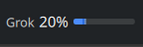
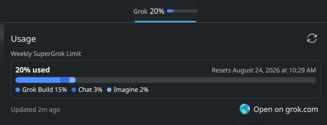
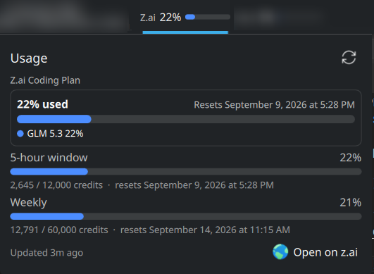

# SuperGrok / Z.ai Usage — KDE Plasma 6 Widgets

Two Plasma 6 panel widgets for AI plan quotas.





## Widgets

- **SuperGrok Usage** — weekly pool: percent used, reset time, Build / Chat / Imagine split.
- **Z.ai Usage** — GLM Coding Plan: 5-hour and weekly windows with percent used, credits, reset times, and a per-model split (GLM 5.3, GLM 5.3 Flash, …).

## Install

**KDE Store** (SuperGrok widget only): *Add Widgets… → Get New…* → search **SuperGrok Usage** ([store.kde.org/p/2368916/](https://store.kde.org/p/2368916/)).

**From this checkout** (both widgets):

```bash
yarn install
yarn widget:panel
yarn plasma:restart
```

## Auth

- **Grok**: `grok login` token, falling back to opencode (`supergrok`/`xai` entry), or `GROK_API_KEY`.
- **Z.ai**: opencode GLM Coding Plan key (`zai-coding-plan`), or `ZAI_API_KEY`.
- Fetching needs Node.js on your `PATH`.
- The Z.ai quota endpoints are undocumented and may change without notice.

## Commands

- `yarn build` — compile TypeScript + emit QML `logic.js`
- `yarn check` — typecheck only
- `yarn test` — build, then run tests
- `yarn widget:init` — (re)install both widgets, symlinked to this checkout
- `yarn widget:copy` — install as copies, independent of this checkout
- `yarn widget:panel` — symlink install + add both widgets to the panel
- `yarn widget:remove` — remove widgets, helpers, and caches
- `yarn dist` — build the KDE Store archives into `dist/` (what Get New Widgets installs)
- `yarn release` — bump/tag, pack, and publish a GitHub release (`yarn release -- minor`, `--dry-run`, …)
- `yarn plasma:restart` — reload plasmashell after QML edits

`dist` and `release` stay separate on purpose: `dist` is a safe, repeatable local
build of the archives; `release` commits, tags, and publishes them. (`pack` is
avoided because yarn reserves it for its own builtin.)

## Layout

- `src/` — shared code; `src/grok/`, `src/zai/` — vendor fetchers
- `package-grok/`, `package-zai/` — the plasmoids

Based on [kde-ai-usage](https://github.com/Muddyblack/kde-ai-usage) and [ai-usagebar](https://github.com/akitaonrails/ai-usagebar).
